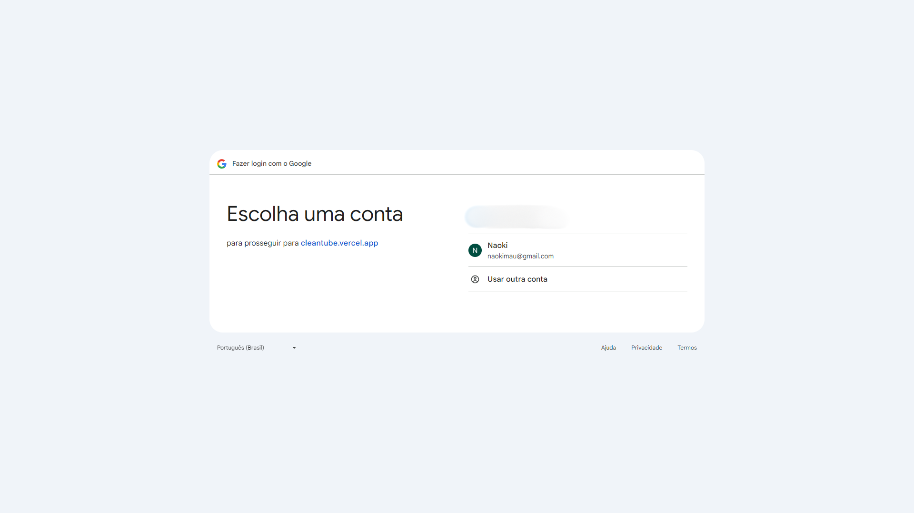
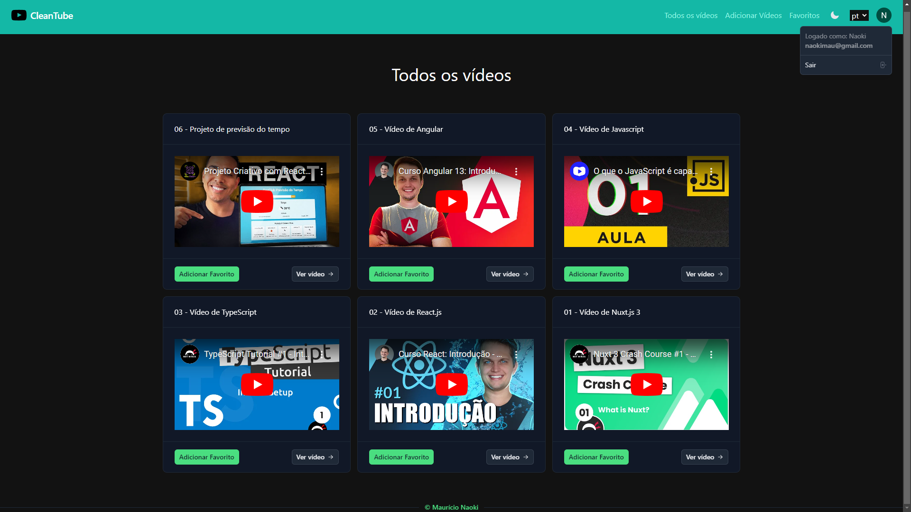
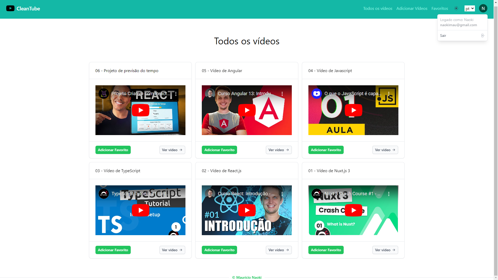
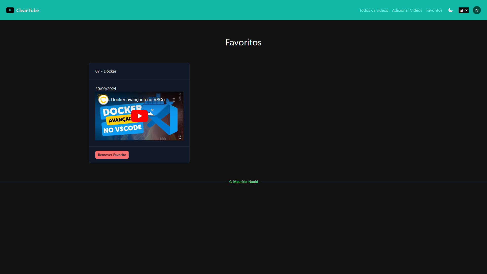

<div align="center"> <h1>CleanTube</h1> </div>

<p align="center">Aplicação para gerenciamento de vídeos do YouTube, com autenticação via Google OAuth</p>

<p align="center">
  
  
  
  
  
</p>

## 📝 Sobre o projeto

CleanTube é uma aplicação que permite gerenciar vídeos do YouTube. A autenticação foi implementada via Google OAuth, configurada pelo Google Cloud, garantindo que somente usuários autenticados possam adicionar, editar ou excluir vídeos. Além disso, foi utilizado o middleware do Nuxt.js para proteger as páginas, impedindo o acesso de usuários não logados.

Os layouts foram criados utilizando o Nuxt UI, que fornece templates prontos para acelerar o desenvolvimento. O backend foi configurado com Nitro, integrado ao Nuxt 3, facilitando a implementação de rotas e funções server-side. Para o gerenciamento de dados, foi utilizado o PostgreSQL como sistema de gerenciamento de banco de dados relacional. 

Os vídeos favoritos são armazenados localmente no navegador, permitindo fácil acesso posterior, e os vídeos são exibidos sem anúncios. Além disso, a aplicação conta com i18n, permitindo a alteração do idioma dos títulos das seções conforme a preferência do usuário.

## 🛠 Tecnologias utilizadas

-   **Vue.js** - Framework JavaScript progressivo
-   **Nuxt.js** - Framework baseado em Vue.js para SSR
-   **Nuxt UI** - Conjunto de componentes prontos para criação de interfaces
-   **Pinia** - Biblioteca de gerenciamento de estado
-   **i18n** - Biblioteca para internacionalização
-   **Nitro** - Camada de servidor do Nuxt para backends e APIs
-   **TypeScript** - Linguagem com tipagem estática para código mais seguro
-   **JavaScript** - Linguagem de programação
-   **HTML** - Estrutura do conteúdo
-   **CSS** - Estilização da interface
-   **Tailwind CSS** - Framework de estilos
-   **PostgreSQL** - Banco de dados relacional

## 📸 Screenshots

<p align="center">
  
</p>

<p align="center">
  
</p>

<p align="center">
  
</p>

<p align="center">
  
</p>

## 🌐 Acesse o projeto online
Você pode acessar a versão online do projeto [aqui](https://cleantube.vercel.app).

## 🖥️ Como configurar o projeto

Siga os passos abaixo para instalar e executar o projeto em seu ambiente local:

### 1. Clone o repositório:

```bash
$ git clone https://github.com/mauricio071/CleanTube
```

### 2. Acesse o diretório do projeto:

```bash
$ cd CleanTube
```

### 3. Instale as dependências necessárias:

```bash
$ npm install
```

### 4. Configure o ambiente:
Para que o projeto consiga consumir a API corretamente, siga os passos abaixo:

#### 1. Configure o PostgreSQL
- Verifique se o PostgreSQL está instalado e em execução em sua máquina.
- Crie um novo banco de dados no PostgreSQL.
- Atualize o arquivo .env com as credenciais e o nome do banco de dados, conforme o exemplo abaixo:

```bash
DB_HOST=SEU-HOST-POSTGRESQL
DB_USER=SEU-NOME-USUÁRIO-POSTGRESQL
DB_PASSWORD=SENHA-POSTGRESQL
DB_DATABASE=NOME-DO-BANCO-DE-DADOS
```

- Em seguida, crie a tabela para armazenar as informações dos vídeos. Abra o editor SQL do PostgreSQL e execute o seguinte comando:
  
```sql
create table videos (
  id SERIAL primary key,
  descricao VARCHAR(255),
  url VARCHAR(255),
  data_postagem DATE
);
```

#### 2. Crie um app no Google Cloud
- Acesse Google Cloud e siga a [documentação oficial](https://cloud.google.com/docs/application-development?hl=pt-br) ou assista [este vídeo](https://www.youtube.com/watch?v=tgO_ADSvY1I&ab_channel=Appwrite) como referência para criar um novo app.
- No console do Google Cloud, navegue até a aba APIs e Serviços e selecione Credenciais.
- Clique em Criar credenciais e escolha ID do cliente OAuth 2.0.
- Configure as permissões de autenticação e adicione as URLs de redirecionamento.
- Copie o Client ID e o Client Secret.

#### 3. Cole as informações no arquivo .env
- No arquivo .env do seu projeto, adicione as seguintes variáveis com os valores obtidos no Google Cloud:
  
```bash
NUXT_OAUTH_GOOGLE_CLIENT_ID=SEU-CLIENT-ID
NUXT_OAUTH_GOOGLE_CLIENT_SECRET=SEU-CLIENT-SECRET
```

### 5. Inicialize o projeto:

```bash 
$ npm run dev
```
toda vez que inicializar o projeto, será gerado um novo NUXT_SESSION_PASSWORD. Você pode definir um valor aleatório no .env:

```bash 
NUXT_SESSION_PASSWORD=CARACTERES-ALEATÓRIAS
```

Agora você pode acessar o projeto no navegador em http://localhost:3000 (ou na porta indicada pelo terminal).
